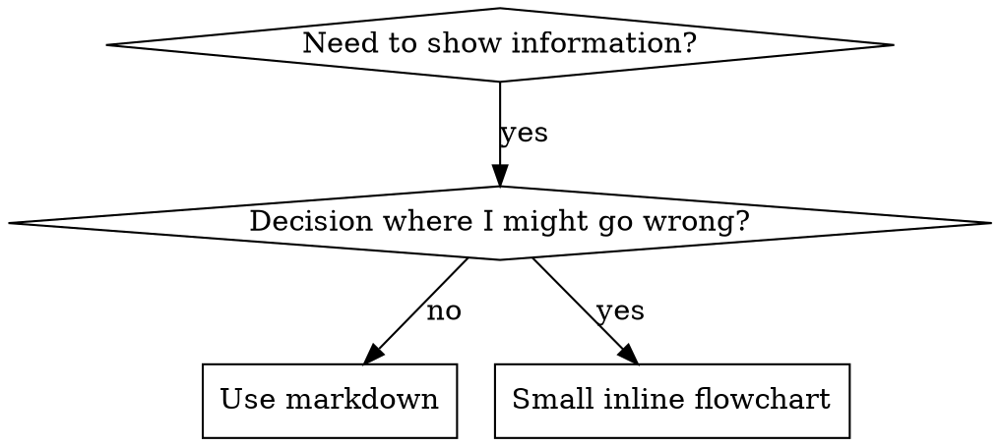

# Writing Skills for Envoy

## Overview

**Writing skills IS Test-Driven Development applied to process documentation.**

You write test cases (pressure scenarios with subagents), watch them fail (baseline behavior), write the skill (documentation), watch tests pass (agents comply), and refactor (close loopholes).

**Core principle:** If you didn't watch an agent fail without the skill, you don't know if the skill teaches the right thing.

**Announce at start:** "I'm using envoy:writing-skills to create/edit this skill."

**REQUIRED BACKGROUND:** You MUST understand envoy:test-driven-development before using this skill. That skill defines the fundamental RED-GREEN-REFACTOR cycle. This skill adapts TDD to documentation.

## What is a Skill?

A **skill** is a reference guide for proven techniques, patterns, or tools.

**Skills are:** Reusable techniques, patterns, tools, reference guides
**Skills are NOT:** Narratives about how you solved a problem once

## TDD Mapping for Skills

| TDD Concept | Skill Creation |
|-------------|----------------|
| **Test case** | Pressure scenario with subagent |
| **Production code** | Skill document (SKILL.md) |
| **Test fails (RED)** | Agent violates rule without skill (baseline) |
| **Test passes (GREEN)** | Agent complies with skill present |
| **Refactor** | Close loopholes while maintaining compliance |
| **Write test first** | Run baseline scenario BEFORE writing skill |
| **Watch it fail** | Document exact rationalizations agent uses |
| **Minimal code** | Write skill addressing those specific violations |
| **Watch it pass** | Verify agent now complies |
| **Refactor cycle** | Find new rationalizations → plug → re-verify |

## When to Create a Skill

**Create when:**
- Technique wasn't intuitively obvious to you
- You'd reference this again across projects
- Pattern applies broadly (not project-specific)
- Others would benefit

**Don't create for:**
- One-off solutions
- Standard practices well-documented elsewhere
- Project-specific conventions (put in CLAUDE.md)

## Skill Types

| Type | Examples | Test Approach |
|------|----------|---------------|
| **Discipline** | TDD, debugging, verification | Pressure scenarios — does agent comply under stress? |
| **Technique** | Visual review, worktrees | Application scenarios — can agent apply it? |
| **Pattern** | Brainstorming, planning | Recognition + application scenarios |
| **Reference** | Stack profiles | Retrieval scenarios — can agent find right info? |

## Directory Structure

```
envoy/
  skills/
    skill-name/
      SKILL.md              # Main reference (required)
      supporting-file.*     # Only if needed (templates, scripts, heavy reference)
  commands/
    skill-name.md           # Optional: slash command shortcut
```

**Flat namespace** — all skills in one searchable namespace.

**Separate files for:**
1. **Heavy reference** (100+ lines) — API docs, comprehensive syntax
2. **Reusable tools** — Scripts, utilities, templates

**Keep inline:** Principles, concepts, code patterns (< 50 lines), everything else.

## SKILL.md Structure

```markdown
---
name: skill-name-with-hyphens
description: Use when [specific triggering conditions]
---

# Skill Name

## Overview
What is this? Core principle in 1-2 sentences.

**Announce at start:** "I'm using envoy:skill-name to [purpose]."

## When to Use
[Small inline flowchart IF decision non-obvious]
Bullet list with SYMPTOMS and use cases
When NOT to use

## Core Pattern / Process
The actual technique or workflow

## Quick Reference
Table or bullets for scanning common operations

## Common Mistakes
What goes wrong + fixes

## Integration with Envoy
How this skill relates to other envoy skills
```

## Frontmatter Rules

- **name:** Use only letters, numbers, hyphens (no spaces, no special chars)
- **description:** Start with "Use when..." — describe triggering conditions only
- Max 1024 characters total
- Written in third person (injected into system prompt)

## Claude Search Optimization (CSO)

**Critical for discovery:** Future Claude needs to FIND your skill.

### Rich Description Field

Claude reads the description to decide which skills to load. Make it answer: "Should I read this skill right now?"

**CRITICAL: Description = When to Use, NOT What the Skill Does**

The description should ONLY describe triggering conditions. Do NOT summarize the skill's process or workflow.

**Why this matters:** When a description summarizes the skill's workflow, Claude may follow the description instead of reading the full skill content. A description saying "code review between tasks" caused Claude to do ONE review, even though the skill's flowchart showed TWO reviews.

When the description was changed to just triggering conditions (no workflow summary), Claude correctly read and followed the full process.

**The trap:** Descriptions that summarize workflow create a shortcut Claude will take. The skill body becomes documentation Claude skips.

```yaml
# ❌ BAD: Summarizes workflow — Claude may follow this instead of reading skill
description: Use when executing plans - dispatches subagent per task with code review between tasks

# ❌ BAD: Too much process detail
description: Use for TDD - write test first, watch it fail, write minimal code, refactor

# ✅ GOOD: Just triggering conditions, no workflow summary
description: Use when executing implementation plans with independent tasks in the current session

# ✅ GOOD: Triggering conditions only
description: Use when implementing any feature or bugfix, before writing implementation code
```

### Keyword Coverage

Use words Claude would search for:
- Error messages: "Hook timed out", "ENOTEMPTY", "race condition"
- Symptoms: "flaky", "hanging", "zombie", "pollution"
- Synonyms: "timeout/hang/freeze", "cleanup/teardown/afterEach"
- Tools: Actual commands, library names, file types

### Descriptive Naming

**Use active voice, verb-first:**
- ✅ `condition-based-waiting` not `async-test-helpers`
- ✅ `creating-skills` not `skill-creation`

**Gerunds (-ing) work well for processes:** `brainstorm`, `writing-skills`, `debugging-with-logs`

### Token Efficiency

**Problem:** Getting-started and frequently-referenced skills load into EVERY conversation. Every token counts.

**Target word counts:**
- Getting-started workflows: <150 words each
- Frequently-loaded skills: <200 words total
- Other skills: <500 words (still be concise)

**Techniques:**

Move details to tool help:
```bash
# ❌ BAD: Document all flags in SKILL.md
search-conversations supports --text, --both, --after DATE, --before DATE, --limit N

# ✅ GOOD: Reference --help
search-conversations supports multiple modes and filters. Run --help for details.
```

Use cross-references:
```markdown
# ❌ BAD: Repeat workflow details
[20 lines of repeated instructions]

# ✅ GOOD: Reference other skill
REQUIRED: Use envoy:other-skill-name for workflow.
```

Eliminate redundancy:
- Don't repeat what's in cross-referenced skills
- Don't explain what's obvious from command
- Don't include multiple examples of same pattern

### Cross-Referencing Other Skills

Use skill name only, with explicit requirement markers:
- ✅ Good: `**REQUIRED SUB-SKILL:** Use envoy:test-driven-development`
- ✅ Good: `**REQUIRED BACKGROUND:** You MUST understand envoy:systematic-debugging`
- ❌ Bad: `See skills/testing/test-driven-development` (unclear if required)
- ❌ Bad: `@skills/testing/test-driven-development/SKILL.md` (force-loads, burns context)

**Why no @ links:** `@` syntax force-loads files immediately, consuming 200k+ context before you need them.

## Adding a Slash Command

Create `commands/skill-name.md`:

```markdown
---
description: Short description for /envoy:skill-name
---

Use and follow the skill-name skill exactly as written
```

## Flowchart Usage



**Use flowcharts ONLY for:**
- Non-obvious decision points
- Process loops where you might stop too early
- "When to use A vs B" decisions

**Never use flowcharts for:**
- Reference material → Tables, lists
- Code examples → Markdown blocks
- Linear instructions → Numbered lists

## Code Examples

**One excellent example beats many mediocre ones.**

**Good example:** Complete, runnable, well-commented (WHY), from real scenario, ready to adapt.

**Don't:** Implement in 5+ languages, create fill-in-the-blank templates, write contrived examples.

## Testing and bulletproofing

The full RED-GREEN-REFACTOR cycle for skills, loophole closure for discipline skills, the rationalizations table, and the deployment checklist live in `testing.md`. Read that file in full before shipping any new or edited skill — it contains the Iron Law, the red-flags list, and the final checklist gate.

## Anti-Patterns

- **Narrative Example:** "In session 2025-10-03, we found..." — Too specific, not reusable
- **Multi-Language Dilution:** example-js.js, example-py.py — Mediocre quality, maintenance burden
- **Code in Flowcharts:** Can't copy-paste, hard to read
- **Generic Labels:** helper1, step3, pattern4 — Labels should have semantic meaning

## Integration with Envoy

- **envoy:test-driven-development** — Same Iron Law applies; required background
- **envoy:pressure-test-scenarios** — Use for baseline testing of discipline skills
- **envoy:verification** — Verify skill works before claiming done
