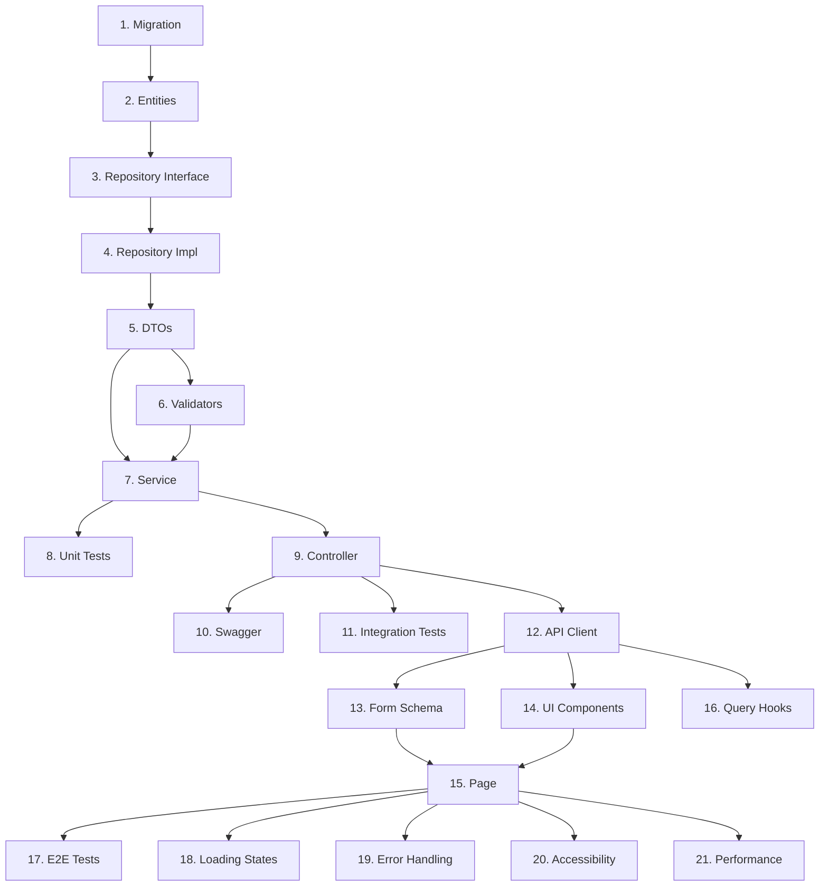

# Spec Document Template

Save as: `docs/plans/YYYY-MM-DD-feature-name.md`

---

```markdown
# Feature Name

> **For Claude:** Use envoy:executing-plans to implement this spec task-by-task.
>
> GitHub Issue: #123

## Overview

Brief summary of what will be implemented and why.

## Architecture

Technical approach, key decisions, and components involved.

## Acceptance Criteria

- [ ] Criterion 1
- [ ] Criterion 2
- [ ] Criterion 3

---

## Implementation Plan

## Execution Strategy

**Strategy:** `batch` | `sequential` | `parallel`

- **batch**: Execute in phases with review checkpoints
- **sequential**: Execute tasks one by one
- **parallel**: Execute independent tasks concurrently

## Tasks

### Phase 1: Foundation

| # | Task | Description | Files | Est. |
|---|------|-------------|-------|------|
| 1 | Create database migration | Add new tables for feature | `Migrations/` | S |
| 2 | Add entity models | Define domain entities | `Domain/Entities/` | S |
| 3 | Create repository interface | Define data access contract | `Application/Interfaces/` | S |
| 4 | Implement repository | PostgreSQL implementation | `Infrastructure/Data/` | M |

**Checkpoint:** Database layer complete, can query new tables

### Phase 2: Business Logic

| # | Task | Description | Files | Est. |
|---|------|-------------|-------|------|
| 5 | Create DTOs | Request/response models | `Application/DTOs/` | S |
| 6 | Add validators | FluentValidation rules | `Application/Validators/` | S |
| 7 | Implement service | Business logic layer | `Application/Services/` | M |
| 8 | Write unit tests | Service layer tests | `Tests/Unit/` | M |

**Checkpoint:** Business logic complete, all unit tests pass

### Phase 3: API Layer

| # | Task | Description | Files | Est. |
|---|------|-------------|-------|------|
| 9 | Create controller | API endpoints | `Api/Controllers/` | M |
| 10 | Add Swagger docs | OpenAPI documentation | `Api/Controllers/` | S |
| 11 | Write integration tests | API endpoint tests | `Tests/Integration/` | M |

**Checkpoint:** API complete, Swagger shows new endpoints

### Phase 4: Frontend

| # | Task | Description | Files | Est. |
|---|------|-------------|-------|------|
| 12 | Generate API client | Run Orval generation | `src/api/` | S |
| 13 | Create form schema | Zod validation schema | `src/schemas/` | S |
| 14 | Build UI components | React components | `src/components/` | L |
| 15 | Create page | Main feature page | `src/pages/` | M |
| 16 | Add React Query hooks | Data fetching hooks | `src/hooks/` | M |
| 17 | Write E2E tests | Playwright tests | `e2e/` | M |

**Checkpoint:** Feature complete end-to-end

### Phase 5: Polish

| # | Task | Description | Files | Est. |
|---|------|-------------|-------|------|
| 18 | Add loading states | Skeleton loaders | `src/components/` | S |
| 19 | Implement error handling | Error boundaries, toasts | `src/components/` | S |
| 20 | Add accessibility | ARIA labels, keyboard nav | `src/components/` | S |
| 21 | Performance optimization | Memoization, lazy loading | Various | M |

**Checkpoint:** Production ready

## Size Estimates

- **S (Small)**: < 30 min, simple change
- **M (Medium)**: 30-60 min, moderate complexity
- **L (Large)**: 1-2 hours, complex implementation

## Dependencies



## Verification Steps

After each phase:

1. Run tests: `dotnet test && npm test`
2. Check build: `dotnet build && npm run build`
3. Manual verification of new functionality
4. Code review checkpoint

## Rollback Plan

If issues are found:

1. Revert migrations if needed
2. Feature flag to disable
3. Previous API version still available

## Notes

- Follow existing patterns in codebase
- Update OpenAPI spec for Orval
- Coordinate with team on database changes
```
